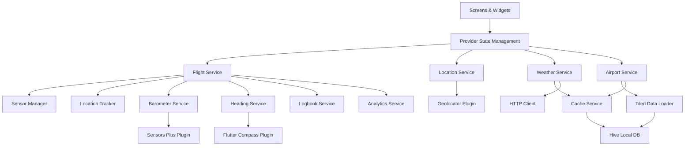

# Architecture

Captain VFR is a cross-platform Flutter mobile application for VFR pilots, providing flight planning, weather information, terrain awareness, and real-time flight tracking.

## Project Structure

```
lib/
├── adapters/          # Type adapters for Hive serialization
├── config/            # Environment configuration
├── constants/         # App-wide constants (colors, themes, markers)
├── l10n/              # Internationalization (7 languages)
├── models/            # Domain models with JSON serialization
├── screens/           # UI screens and their subcomponents
├── services/          # Business logic and external integrations
├── utils/             # Helper functions and utilities
└── widgets/           # Reusable UI components
backend/
└── lambda/            # AWS Lambda functions (SafeSky proxy)
scripts/               # Data processing scripts (elevation, tiles)
assets/                # Static resources (icons, data tiles)
hugo/                  # Marketing website
```

Entry point: `lib/main.dart` initializes Hive, registers adapters, and launches the app with provider-based state management.

## Architectural Pattern

**Service-Oriented Architecture with Provider State Management**

The app follows a service-oriented pattern where business logic is encapsulated in stateless service classes, and UI state is managed through Flutter's Provider pattern. This architecture suits the project because:

- **Separation of concerns**: UI (screens/widgets) is decoupled from business logic (services)
- **Testability**: Services can be tested independently of UI
- **Cross-platform compatibility**: Services abstract platform-specific implementations
- **Offline-first**: Services handle caching and data synchronization transparently

Key design principles:
- **Singleton services**: Most services use the singleton pattern for global access
- **Reactive state**: Services extend `ChangeNotifier` to notify UI of state changes
- **Dependency injection**: Services are provided via Provider at app root
- **Fail-soft execution**: Network failures fall back to cached data

## Component Diagram



## Directory Organization

### Models (`lib/models/`)
Domain entities with JSON serialization via `json_serializable`. Generated `.g.dart` files handle serialization. Key models:
- **Airport**: Airport data with runways, frequencies, weather
- **Airspace**: Controlled airspace boundaries
- **FlightPlan**: Waypoint-based flight plans with trips
- **Flight**: Recorded flight data with segments and points
- **Aircraft**: User's aircraft with logbook integration
- **Pilot**: Pilot licenses and endorsements

### Services (`lib/services/`)
Business logic organized by domain:
- **Flight tracking**: `flight_service.dart` orchestrates sensors, location, and altitude
  - Submodules: `flight/sensors/`, `flight/tracking/`, `flight/calculations/`
- **Data loading**: `airport_service.dart`, `openaip_service.dart`, `tiled_data_loader.dart`
- **Weather**: `weather_service.dart`, `weather_interpretation_service.dart`
- **Terrain**: `terrain_elevation_service.dart`, `srtm_elevation_service.dart`
- **Caching**: `cache_service.dart` with repository pattern in `cache/repositories/`
- **Platform**: `platform_services.dart` abstracts iOS/Android/Web differences

### Screens (`lib/screens/`)
Full-page UI components:
- **map_screen.dart**: Main map view (200KB, complex state management)
  - Subcomponents in `map/`: controllers, overlays, components
- **flight_plans_screen.dart**: Flight planning interface
- **settings_screen.dart**: App configuration
- **logbook/**: Pilot logbook screens

### Widgets (`lib/widgets/`)
Reusable UI components:
- **Markers**: `airport_marker.dart`, `navaid_marker.dart`, `obstacle_marker.dart`
- **Overlays**: `optimized_marker_layer.dart`, `optimized_spatial_airspaces_overlay.dart`
- **Panels**: `flight_tracking_panel.dart`, `flight_planning_panel.dart`
- **Dialogs**: `airport_search_dialog.dart`, `waypoint_editor_dialog.dart`

## Data Flow

### Flight Tracking Flow
1. User taps "Start Flight" in `FlightTrackingPanel`
2. `FlightService.startFlight()` initializes sensors and location tracking
3. `SensorManager` subscribes to barometer, compass, and accelerometer streams
4. `LocationTracker` starts GPS position updates
5. `FlightCalculator` computes speed, altitude, heading from sensor data
6. `SegmentTracker` detects takeoff/landing and segments flight
7. UI updates via `ChangeNotifier` → Provider → Widget rebuild
8. On landing, `FlightHistoryManager` persists flight to Hive
9. `LogbookService` optionally creates logbook entry

### Map Data Loading Flow
1. User pans map to new area
2. `MapScreen` calculates visible tile bounds
3. `TiledDataLoader` checks cache for tile data
4. If cache miss, fetches from CDN (airports, airspaces, navaids)
5. `CacheService` stores fetched data in Hive with TTL
6. Data deserialized into domain models
7. `OptimizedMarkerLayer` renders visible markers with spatial indexing
8. Terrain overlay fetches elevation tiles from `TerrainElevationService`

### Weather Data Flow
1. User taps airport marker
2. `AirportInfoSheet` requests weather for airport ICAO
3. `WeatherService.fetchMetar()` checks cache (5min TTL)
4. If stale, fetches from NOAA/AWC API
5. `WeatherInterpretationService` parses METAR/TAF into human-readable text
6. Translated text displayed using `AppLocalizations` (i18n)
7. Weather overlay shows METAR on map with color-coded flight rules

## External Dependencies

### Aviation Data APIs
- **OpenAIP**: Airspace, airport, navaid data (tiled JSON)
- **OurAirports**: Airport database (CSV, bundled)
- **NOAA AWC**: METAR/TAF weather data
- **SafeSky**: Real-time traffic via AWS Lambda proxy

### Geospatial Services
- **Sonny's LiDAR**: High-resolution European terrain (TIN bundles)
- **SRTM**: Global elevation data (HGT tiles)
- **OpenStreetMap**: Base map tiles via flutter_map

### Platform Services
- **Geolocator**: GPS location (iOS/Android)
- **Sensors Plus**: Barometer, accelerometer (iOS/Android)
- **Flutter Compass**: Magnetic heading (iOS/Android)
- **Hive**: Local NoSQL database (all platforms)

### Backend Infrastructure
- **AWS S3**: CDN for elevation tiles and aviation data
- **AWS Lambda**: SafeSky API proxy (CORS, rate limiting)
- **AWS Amplify**: CI/CD and hosting for Hugo website

Abstraction: Services use dependency injection and platform checks (`kIsWeb`, `Platform.isIOS`) to handle platform differences. Sensor services return null on unsupported platforms.

## Architecture Decision Records

### ADR-001: Service-Oriented Architecture with Provider

**Status**: Accepted

**Context**: Need to manage complex state across multiple screens while keeping business logic testable and platform-agnostic.

**Decision**: Use singleton services for business logic with Provider for state management. Services extend `ChangeNotifier` to notify UI of changes.

**Rationale**: 
- Provider is Flutter's recommended state management solution
- Singleton services ensure consistent state across app
- ChangeNotifier provides reactive updates without boilerplate
- Services can be mocked for testing

**Consequences**: 
- Services must be careful with memory leaks (dispose subscriptions)
- Global state can make debugging harder
- Provider tree can become deep with many services

### ADR-002: Tiled Data Loading for Aviation Data

**Status**: Accepted

**Context**: Loading all airports/airspaces globally (50MB+) is impractical for mobile. Need efficient spatial queries.

**Decision**: Pre-process aviation data into 1°x1° tiles stored as JSON on CDN. Load tiles on-demand based on map viewport.

**Rationale**:
- Reduces initial load time and memory usage
- Enables offline mode by caching tiles
- CDN distribution provides low latency globally
- Tile boundaries align with lat/lon for simple calculation

**Consequences**:
- Requires preprocessing pipeline (Dart scripts in `scripts/`)
- Tile boundaries can cause duplicate data at edges
- Cache invalidation strategy needed (TTL-based)

### ADR-003: Hive for Local Storage

**Status**: Accepted

**Context**: Need fast, cross-platform local database for caching and offline data. SQLite is heavy and requires native code.

**Decision**: Use Hive, a pure-Dart NoSQL database with type adapters for models.

**Rationale**:
- No native dependencies (works on all platforms)
- Fast key-value access for cache lookups
- Type-safe with generated adapters
- Lazy loading of boxes reduces memory usage

**Consequences**:
- No relational queries (must use spatial indexing in memory)
- Schema migrations require manual adapter versioning
- Large boxes can cause memory pressure

### ADR-004: Offline-First with TTL-Based Cache

**Status**: Accepted

**Context**: Pilots often fly in areas with poor connectivity. App must function offline while keeping data reasonably fresh.

**Decision**: Cache all fetched data with TTL (5min for weather, 24h for airports, 7d for airspaces). Serve stale data if network unavailable.

**Rationale**:
- Improves perceived performance (instant load from cache)
- Enables offline mode without explicit download
- TTL ensures data freshness when online
- Graceful degradation when offline

**Consequences**:
- Cache invalidation bugs can show stale data
- Storage usage grows over time (need cleanup)
- TTL values are arbitrary trade-offs

### Template for Future ADRs

```markdown
### ADR-NNN: [Title]

**Status**: Proposed | Accepted | Deprecated | Superseded by ADR-XXX

**Context**: What is the issue that we're seeing that is motivating this decision?

**Decision**: What is the change that we're proposing and/or doing?

**Rationale**: Why is this the best choice given the constraints?

**Consequences**: What trade-offs does this decision introduce?
```
